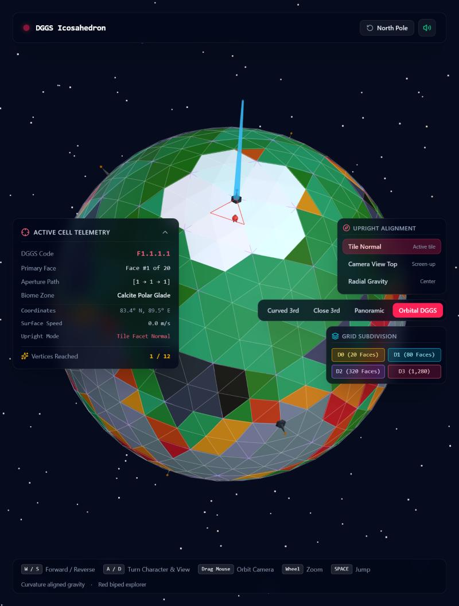
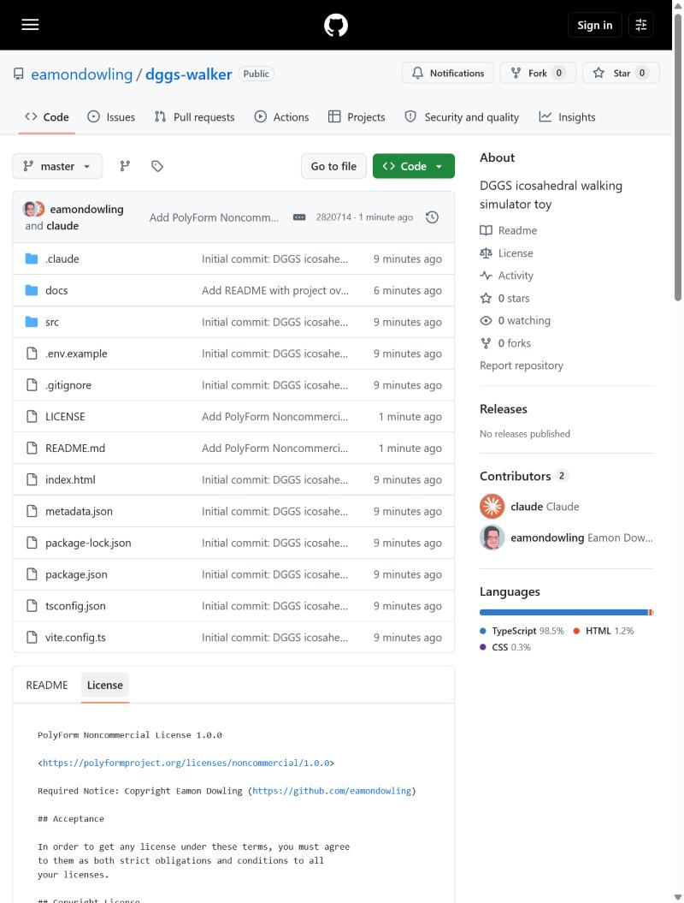

# DGGS Walker

A third-person walking simulator on a discrete global grid system (DGGS): a little
red robot explores an icosahedral, aperture-4, depth-3 tessellated planet, with
curvature-aligned gravity and procedural bipedal animation.



It's a small sandbox for exploring DGGS concepts hands-on — face/cell numbering,
recursive subdivision, tile normals, spherical navigation — more than it is a game.

## Features

- Icosahedron base (20 faces) recursively subdivided at aperture 4 down to depth 3
  (1,280 leaf cells), with a face numbering scheme that follows real row/band
  adjacency (north cap, two offset middle bands, south cap) and a consistent
  medial/vertex/west/east sub-cell index at every depth.
- Spherical character controller: curvature-aligned gravity (radial — always
  upright to the planet center), great-circle movement, and 5 camera modes
  (curved 3rd, close 3rd, wide panoramic, orbital, and a flat unfolded
  icosahedral net view).
- 12 beacons at the icosahedron's base vertices to find, numbered to match the same
  DGGS convention as the faces (0 = north pole, 1-5 upper ring, 6-10 lower ring,
  11 = south pole).
- 5 biome textures (AI-generated locally via ComfyUI + Z-Image-Turbo, see
  [tools/generate_textures.py](tools/generate_textures.py)), triplanar-mapped
  from world position (no UVs) so they read as continuous terrain rather than
  a texture per facet, tinted by the same per-cell color hash used for facet
  legibility. Independent wireframe visibility toggles for each subdivision
  depth (D0-D3).

See [docs/dggs-spec.md](docs/dggs-spec.md) for the full face/beacon numbering
spec, including the adjacency graph and a couple of verified quirks (the
hemisphere chirality flip, and why "next beacon number" and "next reachable
vertex" diverge at the ring crossings).

## Running it

```bash
npm install
npm run dev
```

Then open `http://localhost:3000`.

**Controls:** W/S forward-back, A/D turn, drag mouse to orbit the camera, wheel to
zoom, Space to jump.

## Stack

React 19, Three.js, TypeScript, Vite, Tailwind CSS.

## License

[PolyForm Noncommercial 1.0.0](LICENSE) — free to use, modify, and share for
noncommercial purposes with attribution. Contact me for commercial use.


