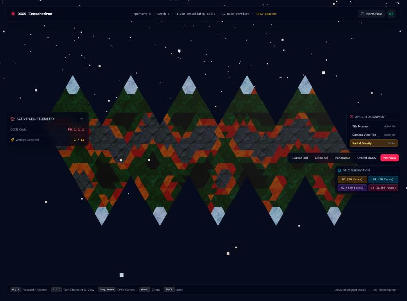

# DGGS Face & Beacon Numbering Spec

This documents the icosahedral DGGS numbering convention implemented in
[`src/dggs/icosahedron.ts`](../src/dggs/icosahedron.ts), replacing the
arbitrary face ordering AI Studio originally generated. Everything below is
verified directly against the running code, not just derived on paper —
see "Verified facts" at the end.

## Base solid

Twelve vertices, built explicitly (not from the golden-rectangle
coordinates AI Studio used), so the poles are real, distinct vertices:

| Index | Name | Position |
|---|---|---|
| 0 | N | `(0, 1, 0)` |
| 1-5 | U0-U4 (upper ring) | longitude `i * 72°`, latitude `+atan(0.5)` (~26.57°) |
| 6-10 | L0-L4 (lower ring) | longitude `i * 72° + 36°`, latitude `-atan(0.5)` |
| 11 | S | `(0, -1, 0)` |

The lower ring is offset 36° from the upper ring — this is inherent to a
regular icosahedron (it's an antiprism band), not a modeling choice.

## Face numbering (0-19)

Four bands of five faces each, viewed pole to pole, left to right:

| Faces | Band | Vertex corner | Base edge | Vertex points |
|---|---|---|---|---|
| 0-4 | north cap | N | `[U(i), U(i+1)]` | north |
| 5-9 | upper band | L(i) | `[U(i), U(i+1)]` (shared with face `i`) | south |
| 10-14 | lower band | U(i+1) | `[L(i), L(i+1)]` (shared with face `5+i` on the left, `5+(i+1)%5` on the right) | north |
| 15-19 | south cap | S | `[L(i), L(i+1)]` (shared with face `10+i`) | south |

Every face's `vertices` tuple is stored as **[vertexCorner, westCorner,
eastCorner]**. "East" always means *increasing ring index*, applied
uniformly across all four bands — there is no mirroring or special-casing
at the Face0/Face4 seam (or any other band seam): it's one continuous
rotational sweep that wraps at `i=4 → i=0`.

## Sub-cell indexing (aperture-4, recursive)

Splitting any triangle `[vertex, west, east]` into 4 children:

- **0** = medial (center, touches none of the parent's original corners)
- **1** = vertex-corner child (contains the parent's vertex point)
- **2** = west-corner child
- **3** = east-corner child

This rule is applied identically at every depth (1, 2, 3) — a depth-3
leaf cell's path like `[2, 1, 3]` means "west child, then that child's
vertex child, then that child's east child."

The medial child's own vertex-corner (for further recursion) is **the
midpoint of the parent's west/east base edge** (`bc` in the code), not
one of the two midpoints touching the parent's vertex corner (`ab`).
`bc` is the medial triangle's true apex — an exact 180° point-reflection
of the parent, verified as a `-1.0000` axis dot product at every depth
tested. The other choice (`ab`) is geometrically meaningless: it's some
other corner, ~60° off, not a real flip. This was a real bug until it
was fixed — before the fix, any leaf cell whose path contained a `0`
didn't actually have a meaningful vertex corner at `vertices[0]`.

## Computing a cell's location without the full table

`getCellVertices` / `getCellCenterDirection` / `getCellPolarCoordinates`
(also in `icosahedron.ts`) recursively descend from a base face through
an arbitrary `face:path` address and return that cell's geometry in
O(depth) — no `DGGSStructure` instance or 1,280-cell table required.
Verified to match the full table's generated centers exactly (0 drift,
checked across all 1,280 leaf cells) — it's the same subdivision step
DGGSStructure uses, just applied along one branch instead of all four
at every level.

There's no closed-form algebraic formula for this (each step
re-normalizes a midpoint onto the sphere, which is nonlinear), but the
recursion itself is simple and exact.

### Orientation: local flip vs. absolute compass direction

`trianglePointsNorth(vertex, west, east)` checks whether an arbitrary
triangle's vertex-corner sits at a higher latitude than its base — a
real, necessary geometric check, not something reducible to bookkeeping.
Two related but different questions came up building this, and it's
worth keeping them straight:

- **Is a child triangle inverted relative to its own immediate parent's
  shape?** Yes, cleanly, for the medial child only (the `-1.0000`
  fact above) — vertex/west/east children are non-inverted, scaled
  copies. This holds at every level, for every face.
- **Does a child triangle point toward the true north or south pole in
  absolute terms?** This does **not** reduce to a simple rule (e.g.
  "count the zeros in the path"). A first pass assumed it would — that
  turned out to be wrong once checked: descending into a west or east
  corner relocates the triangle to a genuinely different point on the
  sphere (the parent's west or east corner), whose own absolute
  north/south relationship depends on where that point actually is, not
  on the parent's orientation. Only the medial step has a clean,
  universal rule; corner steps require calling `trianglePointsNorth` on
  the actual resulting geometry.

## Beacon numbering

Beacons sit at the 12 base vertices and are numbered identically to the
vertex table above — beacon *i* is the icosahedron vertex at index *i*:

- **0** = North Pole
- **1-5** = upper ring, starting at the Face0/Face4 meridian vertex (U0),
  continuing east
- **6-10** = lower ring, same convention, starting at L0
- **11** = South Pole

## Known geometric subtlety: chirality flips between hemispheres

"East" is one uniform rotational direction burned into the whole
structure — it never mirrors at a seam. But two observers standing at
beacon 1 (north) and beacon 6 (south), each facing *away from their own
pole* (the natural orientation after just walking down from it), will see
that same eastward rotation swing to **opposite hands**: at the north,
walking beacons 1→2→3→4→5 reads as left, left, right, right relative to
your facing; at the south, walking 6→7→8→9→10 reads as right, right,
left, left — the mirror image, at the same angles (108°/144°/144°/108°
from forward, verified against the actual `up`/`forward`/`right`
vectors the character controller uses).

This isn't a bug — it's the same reason a clock viewed from behind
appears to run backwards. Your reference frame (which pole you're facing
away from) flips between hemispheres; the rotation itself never does.

## Unfolded net (flat layout)



`src/dggs/net.ts` lays the same 20 faces out flat — the "Net View"
camera mode — oriented around the two middle bands as a horizontal
zigzag strip, with the north cap fanned above it and the south cap
fanned below. This is the same family of projection real DGGS/map
work uses (see Buckminster Fuller's Dymaxion map): every face stays an
exact, undistorted flat triangle; the only "distortion" is conceptual,
at the fold lines between faces, rather than smoothly smeared across
the whole surface the way Mercator or equirectangular projections are.

Because the net has no curvature to account for, subdividing it is
exact plane geometry — no per-level renormalization like the real 3D
cells need. The subdivision step is a direct 2D port of the corrected
medial/vertex/west/east rule above (same case order, same "medial's
true apex is the base-edge midpoint" fact), so `getNetTriangle(faceIndex,
path)` always means the same cell as `getCellVertices` on the sphere —
verified by checking all 20 base faces are exact unit equilateral
triangles, that known-adjacent faces share identical coordinates at
their join, and that the full depth-3 subdivision produces exactly
1,280 non-degenerate leaf triangles whose total area matches 20 unit
equilateral triangles exactly.

Necessarily, an unfolded closed solid needs at least one cut: here it's
the seam between Face 9/Face 14 and Face 5/Face 10 (U0 and L0 each get
a second, separate net-space copy where the strip's right end doesn't
rejoin its left end) — normal for any net, including real cardboard
icosahedron kits.

## Adjacency graph

Every vertex has exactly 5 neighbors (regular icosahedron, degree 5
everywhere), built from the 20 base faces:

```
 0 (N):  [1, 2, 3, 4, 5]
 1 (U0): [0, 2, 5, 6, 10]
 2 (U1): [0, 1, 3, 6, 7]
 3 (U2): [0, 2, 4, 7, 8]
 4 (U3): [0, 3, 5, 8, 9]
 5 (U4): [0, 1, 4, 9, 10]
 6 (L0): [1, 2, 7, 10, 11]
 7 (L1): [2, 3, 6, 8, 11]
 8 (L2): [3, 4, 7, 9, 11]
 9 (L3): [4, 5, 8, 10, 11]
10 (L4): [1, 5, 6, 9, 11]
11 (S):  [6, 7, 8, 9, 10]
```

Note beacon 5 (U4): its neighbors are its two ring-mates (0, 1, 4) plus
**9 and 10** — not 6. Because the lower ring is offset 36°, each upper
vertex is edge-adjacent to the *two* nearest lower-ring vertices, not to
the numerically-next one. "Next beacon number" and "next reachable
vertex" diverge here; a natural walking order that finishes one ring
before crossing will cross at 5→10, not 5→6.

## Verified facts

Checked directly against the code (not hand-derived), reproducible by
importing `DGGSStructure` from `src/dggs/icosahedron.ts`:

- **Topology**: 20 faces, 30 unique edges, each shared by exactly 2
  faces — a valid closed manifold. All 12 vertices are unit length.
- **Band latitudes**: faces 0-4 at ~52.6° lat, 5-9 at ~10.8°, 10-14 at
  ~-10.8°, 15-19 at ~-52.6° — confirms the four bands land exactly where
  the spec says.
- **Seam consistency**: `Face0.west == Face4.east`, and the same holds
  at every other band's wraparound seam (5/9, 10/14, 15/19) — one
  continuous rotation, no mirroring.
- **Hamiltonian paths**: 720 distinct paths visit all 12 vertices exactly
  once via real edges, starting at N and ending at S. The "finish one
  ring, cross once, finish the other ring" family (e.g.
  `0→1→2→3→4→5→10→6→7→8→9→11`) is a small, structurally clean subset of
  those 720 — most zigzag between rings multiple times.
